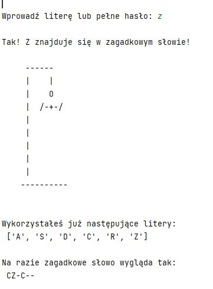

# Project Name
> Program - Gra Wisielec.
## Table of Contents
* [General Info](#general-information)
* [Technologies Used](#technologies-used)
* [Features](#features)
* [Screenshots](#screenshots)
* [Setup](#setup)
* [Usage](#usage)
* [Project Status](#project-status)
* [Room for Improvement](#room-for-improvement)
* [Acknowledgements](#acknowledgements)
* [Contact](#contact)
<!-- * [License](#license) -->
## General Information
The hangman game is a game which consists in guessing the correct password (chosen randomly by the program), 

and then a drawing of a hangman is created.

--

- The main problem is that the program does the drawing of a hangman. 
To make it possible, tuples with typical consecutive elements of drawing a hangman were used.

- Another problem is when the program selects a random password. The 'random' library should be imported so that the program can select a random element from the previously prepared range.

- Also pay attention to the repeating letters and their size!

<!-- You don't have to answer all the questions - just the ones relevant to your project. -->
## Technologies Used
- Python - version 3.10.2
## Features
List the ready features here:

## Screenshots

<!-- If you have screenshots you'd like to share, include them here. -->
## Setup
The program runs on the base PyCharm application libraries.

In order to run the program, you need to import the random library.
## Usage
How does one go about using it?
Provide various use cases and code examples here.
`write-your-code-here`
## Project Status
Project is:  _complete_ . 

This program meets its basic assumptions. All changes are changeable according to individual needs.
## Room for Improvement
Include areas you believe need improvement / could be improved. Also add TODOs for future development.
Room for improvement:

## Acknowledgements
Give credit here.

- This project was based on book : "Python dla każdego Podstawy programowania" Michael Dawson.
- This project was based on book : "Python. Zadania z programowania. Przykładowe imperatywne rozwiązania"
Kubiak Mirosław J.

- Many thanks to PawełP.

## Contact
Created by PawełP & Maciej Cieszynski - feel free to contact us!

<!-- Optional -->