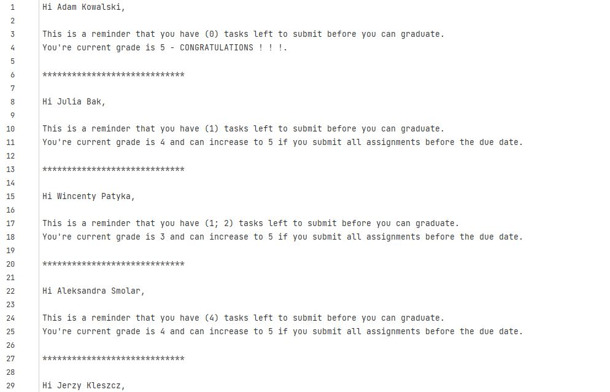

# HACKATON 2
> Program - Teacher Generator.
> 
## Table of Contents
* [General Info](#general-information)
* [Technologies Used](#technologies-used)
* [Features](#features)
* [Screenshots](#screenshots)
* [Setup](#setup)
* [Usage](#usage)
* [Project Status](#project-status)
* [Room for Improvement](#room-for-improvement)
* [Acknowledgements](#acknowledgements)
* [Contact](#contact)
<!-- * [License](#license) -->

## General Information

Generating semester summary messages to students
--

If you are a teacher and don't want to waste many evenings filling out a summary message for your students - this script will save you a lot of time.

- Retrieving information about students from the sheet with grades (without storing them).

- Quick preparation of template messages for school learning (from a few to several hundred students).

- Displaying information such as: student's first and last name, student's class, missing grades, and grade average.

- In the case of the student's absence for the test, the information is displayed that the student was absent and must make up for the test.

<!-- You don't have to answer all the questions - just the ones relevant to your project. -->
## Technologies Used
- Python - version 3.10.2
## Features
List the ready features here:

    -> students_data()
    -> clean_column_value(value)
    -> save_txt(value)
    -> main()
## Screenshots

<!-- If you have screenshots you'd like to share, include them here. -->
## Setup
The program runs on the base PyCharm application libraries.

In order to run the program, you need to import the random library.
## Usage

    def main():
    students_class = []
    students_name = []
    students_surname = []
    students_missing_task = []
    students_rating = []

    for line in students_data():
        splitted_line = line.split(',')
        students_class.append(clean_column_value(splitted_line[0]))
        students_name.append(clean_column_value(splitted_line[1]))
        students_surname.append(clean_column_value(splitted_line[2]))
        students_missing_task.append(clean_column_value(splitted_line[3]))
        students_rating.append(clean_column_value(splitted_line[4]))

    message_for_students = []

    counter = len(students_rating)

    for i in range(1,counter):

        # jak rzuci błędem - tj. user był nieobecny
        # to nie będzie do niego maila
        # a wrzucimy ich na inny plik, tych co nie chodzili
        try:
            if not students_rating[i].isdigit():
                raise ValueError('Incorrect rating')
        except:
            with open('blacklist.txt', 'a+') as f:
                f.write(f'{students_name[i]} {students_surname[i]} --> Nieobecność na zajęciach. \nProsimy zgłosić się do wykładowcy.\n')
                f.write('\n')

        if (students_rating[i] != '5'):

            message = f"Hi {students_name[i]} {students_surname[i]},\n\nThis is a reminder that you have ({students_missing_task[i]}) tasks left to submit before you can graduate. \nYou're current grade is {students_rating[i]} and can increase to 5 if you submit all assignments before the due date.\n\n"

            save_txt(message)

        else:
            message = f"Hi {students_name[i]} {students_surname[i]},\n\nThis is a reminder that you have ({students_missing_task[i]}) tasks left to submit before you can graduate. \nYou're current grade is {students_rating[i]} - CONGRATULATIONS ! ! !.\n\n"

            save_txt(message)
## Project Status
Project is:  _in progress_ . 

## Room for Improvement
Include areas you believe need improvement / could be improved. Also add TODOs for future development.
Room for improvement:

## Acknowledgements
 
- Many thanks to PawełP.

## Contact
Created by PawełP & Maciej Cieszynski - feel free to contact us!

<!-- Optional -->